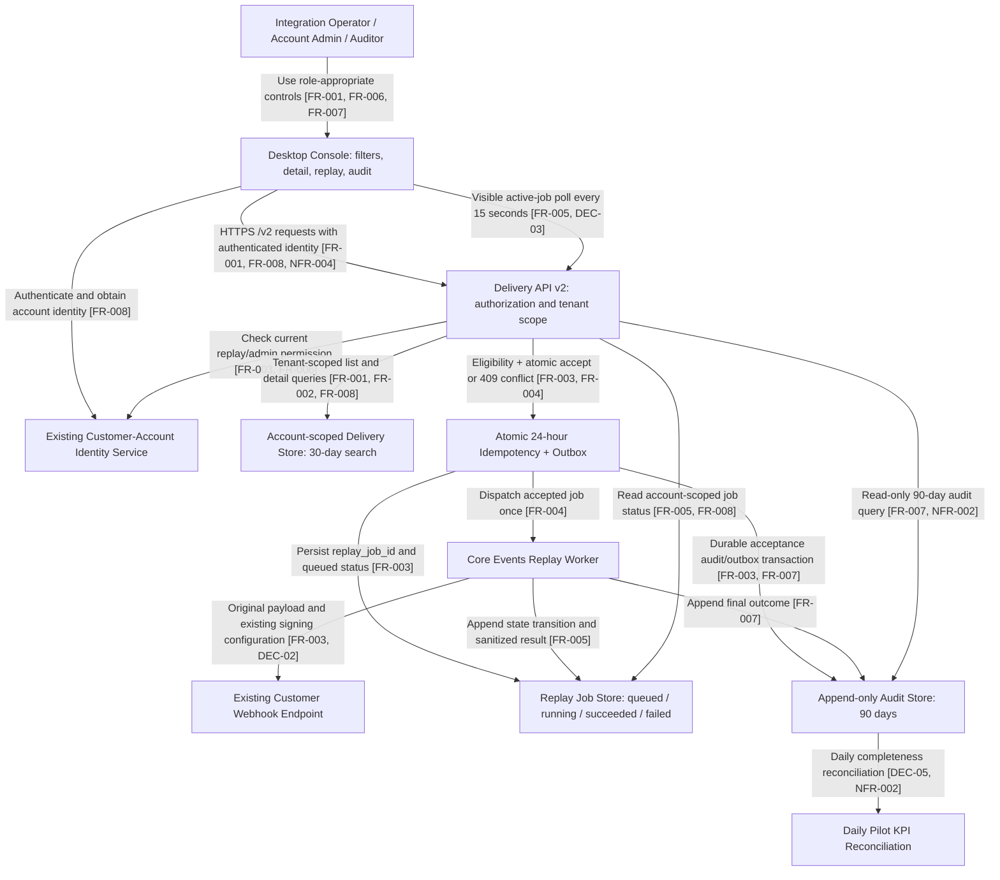

# Product Requirements Document (PRD)

Fictional product scenario. Product-team characters, accounts, budgets and measurements are synthetic; the document author and actual reviewer are user-supplied identities.

## 1. Product Overview

| Field | Value |
|---|---|
| Product Name | RelayOps Webhook Delivery Console |
| Document Version | 1.0 |
| Author | Raghavendra Kaushik |
| Reviewer | Raghavendra Kaushik |
| Date | 2026-09-13 |
| Status | Draft generated from approved requirements; final PRD sign-off remains separate |
| Requirements Approval | Raghavendra Kaushik at 2026-09-13T05:23:30.689109+00:00 |
| Source Revision | 2 / 6a35b08ea78c029a51441b3103475617ec8088903b1e6bf831eaef5ca386af9e |

A tenant-isolated desktop console that lets integration operators investigate failed webhook deliveries and replay eligible events without an engineering-owned script. A three-account pilot covers investigation, permission management, replay orchestration and audit history; the existing identity service and Delivery API v2 remain the systems of record.

Support currently collects an event identifier, asks an engineer to inspect logs, waits for an engineering script to replay the event, and asks again for the result. This creates repeated handoffs, weak operator visibility and inconsistent replay audit records.

[Source: 01-relayops-source-of-truth.json#/overview] [Source: 01-relayops-source-of-truth.json#/problem]

## 2. Goals and Objectives

**Business goal:** Reduce the median elapsed time from a failed-delivery support report to a confirmed replay result from a synthetic baseline of 45 minutes to at most 15 minutes during the four-week pilot.

**User goal:** Enable authorized Integration Operators to find failures, inspect evidence, start one eligible replay and see its final outcome without requesting script access.

| KPI | Baseline | Target | Window | Measurement | Owner |
|---|---|---|---|---|---|
| Median resolution time | 45 minutes across 20 fictional historical tickets | At most 15 minutes | Four-week pilot, 2026-10-12 through 2026-11-08 | Median of support_reported_at to replay_terminal_at for eligible resolved pilot tickets; report unresolved-ticket count separately to avoid survivor bias. | Noor Ali, Product Analytics |
| Self-service completion rate | 0% in the fictional manual process | At least 80% of eligible replay incidents completed without an engineer running a script | Same four-week pilot | Eligible completed incidents with operator-started replay divided by all eligible completed incidents; exclude ineligible 4xx failures and publish the exclusion count. | Noor Ali, Product Analytics |
| Audit completeness | 60% of 20 fictional historical tickets have a traceable actor and outcome | 100% of accepted replay jobs have all required audit fields and a terminal or current state | Daily checks throughout pilot | Reconcile accepted replay_job_id values against append-only audit events; any missing identifier or actor fails release readiness. | Isha Shah, Security Engineering |

[Source: 01-relayops-source-of-truth.json#/metrics]

## 3. User Personas

| Role | Key need | Current workaround | Permissions |
|---|---|---|---|
| Integration Operator | Investigate and replay eligible failed deliveries in the operator's own account. | Open a support ticket and ask engineering to run an internal replay script. | Read delivery records; replay only when an Account Admin has explicitly granted replay permission. |
| Account Admin | Control which operators may initiate replay within the admin's account. | Ask the identity team to change role assignments manually. | Grant or revoke operator replay permission; no cross-account administration. |
| Auditor | Inspect delivery history and replay audit evidence within the auditor's account. | Request CSV extracts from engineering and correlate ticket IDs manually. | Read delivery and audit history only; cannot replay or change permissions. |

[Source: 01-relayops-source-of-truth.json#/personas]

## 4. Feature Requirements

### 4.1 Functional Requirements

| ID | Requirement | Priority (Must/Should/Nice) | Source |
|---|---|---|---|
| FR-001 | Provide an account-scoped delivery list. Combine supplied filters with AND. Use UTC ISO 8601 date bounds, inclusive start and exclusive end. Limit the selected interval and record age to the previous 30 days. Paginate 50 records per page, ordered by timestamp descending and delivery ID descending as the tie-breaker. An empty result displays a clear zero-results message. | Must Have | [Source: 01-relayops-source-of-truth.json#/requirements/0] |
| FR-002 | Display delivery ID, endpoint ID, event type, UTC timestamp, HTTP status code or the literal network_timeout for a timeout, attempt count and last failure reason. Do not expose raw payload bodies, signing secrets or authorization headers. Show replay eligibility and the supported reason when ineligible. | Must Have | [Source: 01-relayops-source-of-truth.json#/requirements/1] |
| FR-003 | Require current replay permission and an explicit confirmation displaying delivery ID and endpoint. Accept only network timeouts or HTTP 5xx failures from the previous 30 days. Reject successful, 4xx, too-old or already-running deliveries. Reuse the immutable original payload and signing configuration. A durable acceptance transaction creates an outbox entry and replay_job_id before dispatch. | Must Have | [Source: 01-relayops-source-of-truth.json#/requirements/2] |
| FR-004 | Deduplicate atomically by authenticated account ID, delivery ID and Idempotency-Key for 24 hours from first acceptance. A duplicate identical request returns the original job ID and current status without enqueueing another job. A duplicate key with a different body returns a conflict. Simultaneous duplicate requests are subject to the same atomic guarantee. | Must Have | [Source: 01-relayops-source-of-truth.json#/requirements/3] |
| FR-005 | Show queued, running, succeeded or failed plus the last status-update timestamp. Poll every 15 seconds while queued/running and the browser tab is visible. Stop on terminal state or hidden tab; refresh immediately when visible again. A manual refresh control is always available. On a transient polling error, keep the last known state, label it stale and retry on the next normal poll; never claim success from missing data. | Must Have | [Source: 01-relayops-source-of-truth.json#/requirements/4] |
| FR-006 | The permission screen lists operators in the authenticated admin account and the current replay permission. Require confirmation for grant and revoke. Re-evaluate permission on every replay POST; a revocation must take effect within 60 seconds. A permission change produces an audit event containing admin actor, target operator, account, action and UTC timestamp. | Must Have | [Source: 01-relayops-source-of-truth.json#/requirements/5] |
| FR-007 | Provide a read-only audit view filterable by UTC date range, actor ID and delivery ID. Every accepted replay records actor ID, account ID, original delivery ID, replay_job_id, UTC request timestamp and current/final outcome. Terminal updates append events rather than overwriting history. Audit retention is 90 days even though replay eligibility and delivery search are 30 days. Permission-change events are also visible. No export feature is included. | Must Have | [Source: 01-relayops-source-of-truth.json#/requirements/6] |
| FR-008 | Derive account scope exclusively from the authenticated identity. Apply scope checks in both service authorization and data queries. Never trust an account ID from the request body or query string. Use non-disclosing 404 responses for inaccessible record IDs and 403 for prohibited actions on accessible records. Audit internal authorization failures without logging payload secrets. | Must Have | [Source: 01-relayops-source-of-truth.json#/requirements/7] |

### 4.2 Non-Functional Requirements

| ID | Requirement | Category | Target | Verification | Owner |
|---|---|---|---|---|---|
| NFR-001 | The delivery-list API must respond in less than 800 ms at p95 under the declared pilot workload. | Performance | p95 &lt; 800 ms with 500 concurrent operators and 100,000 delivery records per account. | Run a 30-minute steady-state load test after five-minute warmup, using realistic filter combinations; report p50, p95, p99, errors and sample count. | Ravi Menon |
| NFR-002 | Accepted replay and permission audit events must remain queryable for 90 days and append-only throughout that interval. | Audit retention | 90-day retention; 100% required audit-field completeness for accepted replay jobs. | Retention-boundary test, append-only permission check and daily job-to-audit reconciliation. | Isha Shah |
| NFR-003 | The pilot console must support desktop Chrome 140 and Edge 140 at viewport widths of 1280 pixels and above. | Browser compatibility | All pilot acceptance scenarios pass in both specified desktop browser versions. Mobile support is explicitly excluded. | Cross-browser regression suite on the pinned synthetic acceptance environment. These versions are fictional project test targets, not a current-browser recommendation. | Ravi Menon |
| NFR-004 | Use TLS 1.2 or higher for console-to-API communication; redact raw payloads, signing secrets and authorization headers from UI and application logs. | Security and privacy | Zero forbidden secret values in the security test corpus; all five route families enforce account isolation. | TLS configuration check, secret-canary scanning and negative authorization tests before launch. | Isha Shah |

[Source: 01-relayops-source-of-truth.json#/nfrs]

### 4.3 API Contracts

**FR-001 - Filter delivery history**

GET /v2/deliveries?status=&endpoint_id=&event_type=&from=&to=&cursor=. Returns HTTP 200 with items and next_cursor; invalid filters return 400. Tenant context comes from the authenticated identity, never a caller-supplied account selector.

**FR-002 - Inspect delivery evidence**

GET /v2/deliveries/{delivery_id}. Returns HTTP 200 for an accessible record, otherwise 404. Existing identity checks precede data lookup.

**FR-003 - Request a single eligible replay**

POST /v2/deliveries/{delivery_id}/replays with required Idempotency-Key and body {"reason":"operator_recovery"}. Responses: 202 accepted; 400 missing key; 401 unauthenticated; 403 missing replay permission; 404 inaccessible delivery; 409 key/body conflict; 422 ineligible; 503 failed durable acceptance.

**FR-004 - Deduplicate replay requests**

The replay POST endpoint owns deduplication. The deduplication key includes tenant and delivery identifiers. Keys are not shared across accounts. Expired keys require a fresh eligibility check before any new replay.

**FR-005 - Observe replay status**

GET /v2/replay-jobs/{replay_job_id}. HTTP 200 includes replay_job_id, status, updated_at and sanitized failure_code for failed jobs. Cross-account or absent jobs return 404. State transitions are queued -> running -> succeeded|failed.

**FR-006 - Manage replay permissions**

PUT /v2/operators/{operator_id}/replay-permission with {"enabled":true|false}. HTTP 200 after durable update and audit; 403 for non-admins; 404 for a target outside the account.

**FR-007 - Inspect immutable audit history**

GET /v2/audit-events?from=&to=&actor_id=&delivery_id=&cursor=. Returns append-only events for up to 90 days. The public pilot API exposes no audit update or delete operation.

**FR-008 - Enforce account isolation**

All /v2 console routes use authenticated account scope. API authorization is mandatory even when the corresponding UI action is hidden.

### 4.4 Detailed Product Architecture

[Source: 01-relayops-source-of-truth.json#/architecture] Diagram edges include supporting requirement/decision IDs.

## 5. Acceptance Criteria

### FR-001 - Filter delivery history

**AC-001**
- **GIVEN** an authenticated operator in account-pilot-a and delivery records across two accounts
- **WHEN** the operator filters status=failed, endpoint=ep-12, event_type=invoice.paid and a valid UTC date range
- **THEN** only account-pilot-a records matching every filter are returned in the specified order, with at most 50 records per page

**AC-002**
- **GIVEN** an authenticated operator and a date range longer than 30 days or with start greater than or equal to end
- **WHEN** the operator requests delivery history
- **THEN** the API returns HTTP 400 with code INVALID_DATE_RANGE and the UI explains the allowed range without returning delivery records

[Source: 01-relayops-source-of-truth.json#/requirements/0/acceptance_criteria]

### FR-002 - Inspect delivery evidence

**AC-003**
- **GIVEN** an operator with access to a failed delivery in the same account
- **WHEN** the operator opens its detail view
- **THEN** all seven specified evidence fields and replay eligibility are displayed, without raw payloads or secret headers

**AC-004**
- **GIVEN** an operator requesting a delivery ID that does not exist in the authenticated account
- **WHEN** the operator opens the detail view
- **THEN** the API returns HTTP 404 with code DELIVERY_NOT_FOUND and reveals no other account metadata

[Source: 01-relayops-source-of-truth.json#/requirements/1/acceptance_criteria]

### FR-003 - Request a single eligible replay

**AC-005**
- **GIVEN** a permitted operator, an eligible same-account HTTP 5xx failure, and a fresh Idempotency-Key
- **WHEN** the operator confirms and sends a replay request
- **THEN** the API returns HTTP 202 with replay_job_id and queued status, and one durable replay job is accepted

**AC-006**
- **GIVEN** a permitted operator and an HTTP 4xx, successful, older-than-30-days or already-running delivery
- **WHEN** the operator requests replay
- **THEN** the API returns HTTP 422 with code DELIVERY_NOT_ELIGIBLE and enqueues no replay job

[Source: 01-relayops-source-of-truth.json#/requirements/2/acceptance_criteria]

### FR-004 - Deduplicate replay requests

**AC-007**
- **GIVEN** an accepted replay and its Idempotency-Key within the 24-hour window
- **WHEN** the same account retries the identical request concurrently or sequentially
- **THEN** every accepted response references the original replay_job_id and exactly one job has been enqueued

**AC-008**
- **GIVEN** an accepted replay key within its 24-hour window
- **WHEN** the same account and delivery reuse the key with a different request body
- **THEN** the API returns HTTP 409 with code IDEMPOTENCY_CONFLICT and no second job is created

[Source: 01-relayops-source-of-truth.json#/requirements/3/acceptance_criteria]

### FR-005 - Observe replay status

**AC-009**
- **GIVEN** a visible browser tab showing a queued or running replay
- **WHEN** 15 seconds elapse
- **THEN** the UI requests current status and updates only from a successful response; polling stops when succeeded or failed is returned

**AC-010**
- **GIVEN** a queued replay view that becomes hidden or experiences a failed status request
- **WHEN** the tab is hidden and later visible, or the status request fails
- **THEN** background polling stops while hidden; visibility restoration triggers immediate refresh; a failed request preserves the last known state and displays a stale-state warning

[Source: 01-relayops-source-of-truth.json#/requirements/4/acceptance_criteria]

### FR-006 - Manage replay permissions

**AC-011**
- **GIVEN** an Account Admin and an operator in the same account
- **WHEN** the admin confirms a grant or revoke
- **THEN** the permission record changes, an audit event is written, and the new permission is enforced on replay requests within 60 seconds

**AC-012**
- **GIVEN** an Integration Operator or Auditor without the Account Admin role
- **WHEN** the user calls the permission-management endpoint
- **THEN** the API returns HTTP 403 with code ADMIN_ROLE_REQUIRED and makes no permission change

[Source: 01-relayops-source-of-truth.json#/requirements/5/acceptance_criteria]

### FR-007 - Inspect immutable audit history

**AC-013**
- **GIVEN** an Auditor in an account with accepted replay jobs and terminal outcomes
- **WHEN** the auditor filters the audit view
- **THEN** only that account's audit events appear and every replay is traceable through all six required audit fields

**AC-014**
- **GIVEN** an authenticated Auditor
- **WHEN** the auditor attempts replay, permission modification or audit modification
- **THEN** each prohibited operation is rejected with HTTP 403 and no write or replay is performed

[Source: 01-relayops-source-of-truth.json#/requirements/6/acceptance_criteria]

### FR-008 - Enforce account isolation

**AC-015**
- **GIVEN** a valid user session from account-pilot-a and a delivery or replay job belonging only to account-pilot-b
- **WHEN** the user requests that identifier or supplies a forged account selector
- **THEN** the API returns HTTP 404 or rejects the unsupported selector and returns no account-pilot-b data

**AC-016**
- **GIVEN** a cross-account test matrix covering delivery list, detail, replay, permission management and audit history
- **WHEN** the isolation suite executes with all three pilot account identities
- **THEN** zero cross-account reads or writes succeed and no replay job is enqueued by a cross-account request

[Source: 01-relayops-source-of-truth.json#/requirements/7/acceptance_criteria]

## 6. Out of Scope

- Bulk replay and scheduled replay
- Creating or editing webhook endpoints
- New webhook signing algorithms
- Mobile and native applications
- AI-generated failure explanations
- Customer-facing CSV or spreadsheet export in the pilot

[Source: 01-relayops-source-of-truth.json#/out_of_scope]

## 7. Dependencies

| Dependency | Owner | Status | Risk | Mitigation |
|---|---|---|---|---|
| Delivery API v2 | Leo Chen, Core Events | Existing API; pilot contract additions due 2026-09-25 | Delayed status-query support prevents end-to-end replay observation. | Contract tests at integration start; feature flag remains off if readiness fails. |
| Replay-worker API | Leo Chen, Core Events | Synthetic commitment: staging available 2026-09-25 | Worker readiness is a critical-path dependency. | Daily contract smoke test from 2026-09-25; launch requires successful enqueue-to-terminal test. |
| Customer-account identity service | Omar Khan, Identity Team | Existing service; replay-permission endpoint contract signed 2026-09-11 | Stale role propagation could retain revoked access. | Every replay authorization checks current permission; revocations take effect within 60 seconds. |
| Append-only audit store | Isha Shah, Security Engineering | Existing storage; retention policy configured by 2026-09-28 | Audit write failure could create an untraceable replay. | Atomic outbox transaction records acceptance before dispatch; do not accept replay if transaction fails. |

[Source: 01-relayops-source-of-truth.json#/dependencies]

## 8. Assumptions

| Explicit assumption | Owner | Validation basis |
|---|---|---|
| The three fictional pilot accounts use the existing customer-account identity service and have no external SSO migration during this pilot. | Omar Khan, Identity Team | Verified in the synthetic pilot-readiness inventory on 2026-09-11. |
| A replay reuses the original immutable event payload and existing signing configuration; it does not create or edit an event. | Leo Chen, Core Events | Recorded as decision DEC-02 and included in replay contract review. |
| The synthetic workload of 100,000 delivery records per account and 500 concurrent operators is sufficient for pilot capacity testing. | Aditi Rao, Engineering Lead | Explicit pilot sizing decision; expansion beyond this envelope requires a new capacity review. |

[Source: 01-relayops-source-of-truth.json#/assumptions]

## 9. Open Questions

All six product-scope questions raised in discovery were resolved in DEC-01 through DEC-06. Any new missing information or conflicting evidence reopens review and blocks PRD generation.

| Decision | Question | Resolution | Owner | Date |
|---|---|---|---|---|
| DEC-01 | Which delivery failures are eligible? | Only network timeouts and HTTP 5xx failures from the previous 30 days are eligible. HTTP 4xx, successful and already-running deliveries are not eligible. | Maya Sen | 2026-09-11 |
| DEC-02 | What happens when a key is reused? | Within 24 hours, the same account, delivery and Idempotency-Key with an identical body returns the original replay_job_id without another enqueue. Reusing the key with a different body returns HTTP 409. | Leo Chen | 2026-09-11 |
| DEC-03 | How often does job status refresh? | The UI polls job status every 15 seconds only while the job is queued or running and the tab is visible. Polling stops on terminal status or hidden tab and refreshes immediately when the tab becomes visible. Manual refresh is available. | Aditi Rao | 2026-09-11 |
| DEC-04 | Is customer-facing export included? | No customer-facing export in the pilot. Auditors use the account-scoped on-screen audit view. | Maya Sen | 2026-09-11 |
| DEC-05 | Who owns KPI reporting? | Noor Ali owns daily dashboard reconciliation and the final four-week pilot report. | Maya Sen | 2026-09-11 |
| DEC-06 | Is the worker availability still unknown? | The earlier discovery uncertainty is superseded by the synthetic Core Events commitment of staging availability on 2026-09-25. This is a sample scenario decision, not a real team commitment. | Leo Chen | 2026-09-11 |

[Source: 01-relayops-source-of-truth.json#/decisions]

## 10. Timeline

| Milestone | Target Date | Owner | Exit criterion |
|---|---|---|---|
| Requirements and architecture review | 2026-09-18 | Maya Sen and Aditi Rao | Reviewer approves source-backed requirements, API contracts and scope decisions. |
| Design Complete | 2026-09-21 | Elena Park, Product Design | Desktop interaction and permission-error designs signed off. |
| Development Start | 2026-09-22 | Aditi Rao | Sprint backlog accepted and mocked API contracts available. |
| Integration ready | 2026-09-28 | Leo Chen | Identity, worker and audit integration contract tests pass. |
| QA / Testing | 2026-10-05 | Ravi Menon, QA Lead | Functional, tenant-isolation, replay-deduplication, browser and capacity tests pass. |
| Launch | 2026-10-12 | Maya Sen | Go/no-go approval; three account feature flags enabled; monitoring and rollback staffed. |
| Pilot review | 2026-11-09 | Noor Ali | Four-week KPI report, incident review and rollout recommendation reviewed. |

[Source: 01-relayops-source-of-truth.json#/timeline]

### Delivery and rollout

**Budget:** Synthetic pilot engineering budget: USD 48,000, including a USD 3,000 infrastructure ceiling for the four-week pilot.

**Team:** One PM, one designer, two backend engineers, one frontend engineer and one QA engineer; security and identity owners provide part-time review.

**Rollout:** Enable the feature for exactly three fictional accounts, account-pilot-a, account-pilot-b and account-pilot-c, on 2026-10-12 after go/no-go approval.

**Rollback:** Disable replay controls using the per-account feature flag; continue read-only inspection and let already accepted jobs finish. Do not delete queued jobs or audit records.

**Support:** Core Events owns worker incidents; Identity owns authorization incidents; Security owns audit gaps. Maya coordinates the pilot incident review.

[Source: 01-relayops-source-of-truth.json#/delivery]

### Review provenance

| Review ID | Revision | Approval hash |
|---|---|---|
| 26ec68ea-3b6b-48ed-8fee-63d8e9d3b14c | 2 | 6a35b08ea78c029a51441b3103475617ec8088903b1e6bf831eaef5ca386af9e |

### Reviewer amendments

| Field | Confirmed value | Confirmed by | When |
|---|---|---|---|
| /metadata/reviewer | "Raghavendra Kaushik" | Raghavendra Kaushik | 2026-09-13T05:23:02.432893+00:00 |

Reviewer amendments supersede the corresponding catalog values. Their explicit answer records are the source for changed fields.
